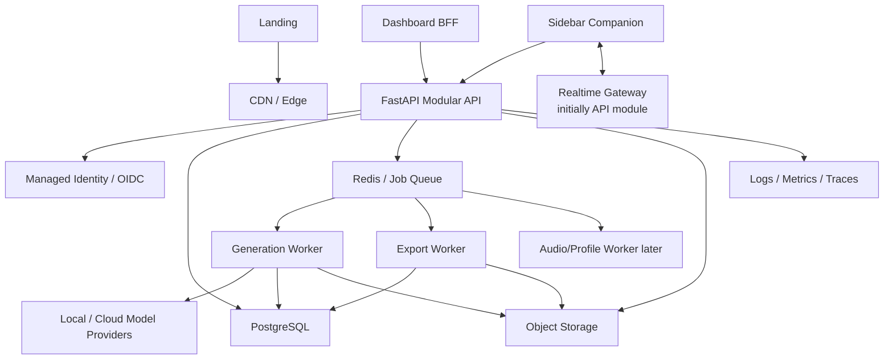

# 01. Системная архитектура

## Constraints

- ранний продукт;
- маленькая команда;
- неизвестная нагрузка;
- AI/generation latency и cost отличаются от обычного CRUD;
- browser и native/sidebar auth;
- realtime delivery в FL;
- binary MIDI/audio/export artifacts;
- чувствительное creative content;
- требуется local/offline fallback на стороне sidebar.

## Architecture style

Modular FastAPI monolith с отдельными workers:



## Deployables MVP

1. `api` — REST, auth resource server, SSE, initial WebSocket.
2. `worker` — generation + export queues initially.
3. `scheduler` — cleanup/expiry/reconciliation; может быть worker mode.
4. PostgreSQL managed.
5. Redis managed.
6. S3-compatible object storage.
7. Identity provider.

Landing/dashboard deploy отдельно, но используют backend contracts.

## Backend modules

### Identity

- provider subject mapping;
- user/account status;
- sessions/device grants references;
- authorization helpers;
- deletion/lock.

### Projects

- project metadata;
- ownership;
- default musical settings;
- source surface;
- lifecycle.

### Conversations

- conversations;
- typed messages;
- branching/parent links;
- cursors/version;
- sync browser/sidebar.

### Generation

- ChatRequest;
- immutable context snapshot;
- intent/controls;
- GenerationJob;
- provider routing;
- validation/ranking;
- CandidateSet;
- cancellation/retry;
- cost/latency.

### Artifacts

- metadata;
- object keys/checksums;
- media types;
- retention;
- signed access;
- provenance.

### Exports

- scope selection;
- snapshot;
- packaging;
- manifest/checksum;
- lifecycle/download.

### Devices/Realtime

- device records/scopes;
- presence;
- delivery commands;
- ack/status;
- revoke/disconnect;
- cursor/resync.

### Profiles

- Creator DNA metadata/features;
- profile sources;
- versions;
- consent;
- export/delete;
- conditioning reference.

### Entitlements/Usage

- plan/features;
- quota;
- successful/failed charge policy;
- provider cost;
- billing webhooks.

### Privacy/Audit

- consents;
- data export/deletion;
- security audit events;
- retention jobs;
- support access audit.

## Dependency direction

```text
HTTP/Realtime adapters
    -> application use cases
        -> domain modules/schemas
            -> infrastructure adapters
```

Не создавать abstract repository для каждого CRUD table заранее. Использовать ORM/session прямо в module service, выделяя interfaces только для model providers, object storage, queue и identity — внешних систем, которые реально могут меняться.

## Synchronous vs asynchronous

### Synchronous

- CRUD metadata;
- fetch conversations/messages;
- validate/create ChatRequest;
- create export request;
- device authorize/revoke;
- signed URL request;
- entitlement check.

### Asynchronous

- model generation;
- heavy validation/ranking;
- preview rendering;
- conversation export packaging;
- profile/audio analysis;
- deletion sweeps;
- billing/usage aggregation.

API возвращает durable resource/job ID до начала долгой работы.

## Transactional reliability

Создание ChatRequest и enqueue job не должно расходиться.

MVP решение:

- database transaction создаёт request/job + outbox row;
- dispatcher публикует outbox в queue;
- worker idempotently claims job;
- duplicate event не создаёт duplicate CandidateSet;
- reconciliation ищет stuck outbox/jobs.

Kafka/event sourcing не нужны.

## Multi-tenancy

MVP: ownership по `user_id`.

- каждая query scoped;
- authorization service не принимает owner ID от client как доверенный;
- object keys opaque;
- signed URLs выдаются только после ownership check.

Teams/workspaces не добавляются до product demand. Revisit trigger: реальные shared projects/organization billing.

## Failure isolation

- provider failure не делает API unavailable;
- export queue не блокирует interactive generation;
- audio/profile jobs later use separate queue;
- malformed model output fails validation;
- realtime outage не теряет durable command state;
- object storage failure оставляет job retryable;
- identity outage не отменяет уже проверенные short sessions без policy.

## Environments

- local with emulated/containers as appropriate;
- test;
- preview/staging with sandbox identity/providers/billing;
- production.

Production data/credentials никогда не копируются в lower environments.

