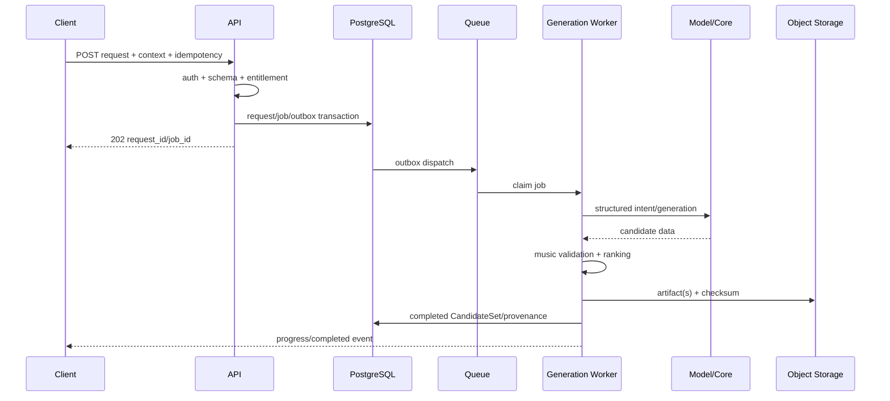

# 04. Generation, artifacts и exports

## ChatRequest pipeline

## Immutable input snapshot

Worker uses snapshot captured when request was created:

- context schema/version/hash;
- intent/controls;
- profile ID + exact version;
- user-visible constraints;
- generator routing policy version.

Subsequent project edits do not silently change in-flight request.

## Generation stages

1. Input schema/limits.
2. Context minimization/normalization.
3. Natural-language intent parsing if used.
4. Intent schema validation.
5. Constraint construction.
6. Engine routing: local/rule/symbolic/cloud.
7. Candidate sampling.
8. Music validation.
9. Similarity/leakage checks.
10. Diversity/ranking.
11. Artifact serialization.
12. Provenance/cost/status persist.

## Prompt discipline

- prompts/templates in version control;
- model/provider/config version;
- JSON/function schema;
- regression corpus before release;
- user content delimiters;
- no arbitrary tools;
- partial stream never persisted as completed CandidateSet;
- fallback when parser/model unavailable;
- tokens/cost logged without raw content.

## Engine routing

| Operation | Preferred | Fallback |
|---|---|---|
| Humanize | local deterministic | none needed |
| Simplify | local rule | deterministic |
| Variation | local/rule symbolic | deterministic |
| Continue | symbolic model | constrained rule |
| Bassline/Harmonize | rule/symbolic | explicit constraints/error |
| Audio render later | external/local renderer | MIDI only |

Cloud AI не вызывается, если local engine решает operation с достаточным quality.

## Job states

- `queued`;
- `running`;
- `cancelling`;
- `completed`;
- `failed_retryable`;
- `failed_terminal`;
- `cancelled`;
- `expired`.

Retry создаёт new attempt с тем же logical job/request; CandidateSet публикуется ровно один final version, если продукт не показывает attempts отдельно.

## Idempotency

- client sends key;
- key scoped to user + endpoint;
- same key/same normalized body returns same resource;
- same key/different body rejected;
- delivery command one-time;
- worker writes compare-and-set/unique constraints;
- export duplicate can reuse running/completed job for same snapshot/options.

## Artifacts

Kinds:

- `midi_context`;
- `midi_candidate`;
- `midi_selected_result`;
- `audio_preview`;
- `profile_features`;
- `conversation_export`;
- `account_export`;
- `validation_report`.

Artifact metadata in PostgreSQL; binary/large structured content in object storage.

## Provenance

Minimum:

- source context hash;
- request ID;
- operation/controls;
- profile version;
- engine/model/prompt version;
- seed;
- validation version/results;
- created time;
- candidate label;
- parent artifact/request;
- content checksum.

## Export pipeline

1. Authorize scope.
2. Snapshot resource versions.
3. Resolve included completed requests/artifacts.
4. Reject missing/unauthorized/deleted content.
5. Generate transcript/JSONL/manifests.
6. Copy/serialize MIDI/audio according to options.
7. Sanitize paths/names.
8. Generate SHA-256 checksums.
9. Create ZIP in streaming/temp-safe manner.
10. Upload object.
11. Persist export artifact/status.
12. Notify client.
13. Serve short signed link.
14. Expire/delete according to policy.

## Conversation transcript

`transcript.md` includes:

- conversation title/time;
- user messages;
- interpreted operations;
- completed/failed request summaries;
- selected result links/filenames;
- not internal chain-of-thought/provider prompts;
- privacy/provenance note.

## Export consistency

Export uses immutable snapshot/version so a conversation changed during packaging does not produce half-old/half-new bundle. Manifest records snapshot time and resource versions.

## Usage/cost

Record per job:

- engine/provider/model;
- input/output tokens where applicable;
- compute duration;
- provider charge units;
- candidates produced/validated;
- user charged quota units;
- accepted result later.

Primary efficiency metric: cost per accepted creative action, not cost per request alone.

## Cancellation

- API marks cancellation intent;
- worker/provider cancel if supported;
- completed race resolved deterministically;
- no partial artifact presented as final;
- billing policy explicit;
- client resyncs status.

## Provider abstraction

Interface boundaries only around real variability:

- intent parser;
- symbolic generator;
- audio renderer;
- object storage;
- queue.

Do not build a universal provider framework before two implementations or a concrete migration need.

