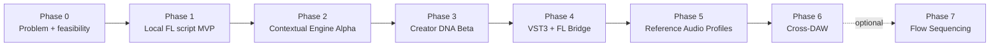

# 00. Общая дорожная карта

## Общий горизонт

План рассчитан примерно на **9–12 месяцев** для одного сильного full-time builder с периодической помощью music-domain, design, plugin и legal специалистов. Для part-time режима сроки увеличиваются в 1,5–2,5 раза.

Сроки — ориентиры. Переход определяется gate, а не календарём.

## Карта этапов

## Phase 0 — Problem and feasibility validation

**Срок:** 2–3 недели  
**Цель:** доказать, что проблема существует и FL script может безопасно менять Piano Roll.

Результаты:

- 15 интервью;
- карта текущих workarounds;
- конкурентные тесты;
- minimal `.pyscript` spike;
- проверка selection, insertion, failure и undo;
- 5 design partners;
- baseline evaluation corpus.

Gate:

- ≥10/15 имеют недавний concrete creative block;
- ≥5 готовы тестировать на реальных проектах;
- script безопасно вставляет/изменяет notes;
- нет нерешаемого blocker для distribution.

Если gate не пройден: сузить use case или отказаться от FL-first.

## Phase 1 — Local FL Script MVP

**Срок:** 3–5 недель  
**Цель:** проверить бесшовный transform workflow без cloud AI.

Scope:

- `Variation`;
- `Continue`;
- `Simplify`;
- `Humanize`;
- 2–4 candidates через повторный запуск/presets;
- deterministic seed;
- safe insert/replace;
- basic local telemetry/exported feedback form;
- installation package/instructions.

Gate:

- 80% testers устанавливают без созвона;
- median time-to-first-result < 5 минут;
- ≥30% valid requests заканчиваются insertion;
- zero data-loss incidents;
- contextual baseline предпочитают random baseline.

## Phase 2 — Contextual Signal Engine Alpha

**Срок:** 5–7 недель  
**Цель:** отделить core от FL и доказать повышение качества.

Scope:

- canonical schemas;
- validator;
- rule/probability engine;
- candidate diversity/ranking;
- local service или library boundary;
- optional natural-language intent parser;
- versioned regression suite;
- latency/cost observability;
- 20–30 alpha users.

Gate:

- 100% inserted outputs schema-valid;
- p95 local response < 1 s для common transforms;
- p95 cloud < 5 s, если cloud используется;
- preference advantage над Phase 1 baseline;
- W1 повторное использование ≥40% в guided cohort.

## Phase 3 — Creator DNA Beta

**Срок:** 6–8 недель  
**Цель:** проверить главную дифференциацию — личный профиль.

Scope:

- import выбранных собственных MIDI;
- derived profile generation;
- profile inspector;
- multiple profiles;
- generic vs personalized A/B;
- export/delete;
- opt-in cloud sync;
- privacy controls;
- 50–100 beta users.

Gate:

- profile-conditioned variants значимо выигрывают generic;
- ≥50% eligible users создают профиль;
- deletion/export работают end-to-end;
- privacy concept не снижает activation критически;
- нет evidence, что профиль просто переобучается/копирует source.

Если personalization не даёт эффекта, оставить profile как controls preset, а не строить ML moat вокруг недоказанного сигнала.

## Phase 4 — VST3 Copilot + FL Bridge

**Срок:** 8–12 недель  
**Цель:** создать постоянный production-quality интерфейс и основу cross-DAW.

Scope:

- VST3 Windows/macOS;
- resize/scaling;
- project tempo/transport sync;
- candidate browser и preview;
- profile management;
- state serialization;
- signed installers;
- FL-specific insertion bridge или validated fallback;
- crash reporting;
- offline core transforms.

Gate:

- crash-free sessions >99.5%;
- успешный scan/install >95% на тестовой матрице;
- project reopen восстанавливает state;
- FL insertion работает либо fallback понятен пользователю;
- beta retention оправдывает plugin engineering/support cost.

## Phase 5 — Reference Audio Profiles

**Срок:** 6–10 недель  
**Цель:** безопасно вернуть исходную идею анализа референсов.

Scope:

- local/sidecar decode;
- tempo/key/rhythm/timbre features;
- confidence и feature explanations;
- automatic raw deletion;
- blend reference profiles;
- generate through musical grammar, а не напрямую из brightness;
- legal/privacy review;
- profile quality study.

Gate:

- reference profile улучшает user preference;
- processing success >95% на supported files;
- users понимают controls;
- no raw audio retention by default;
- юрист подтверждает launch posture и terms для целевого рынка.

## Phase 6 — Cross-DAW

**Срок:** 8–16 недель, по одному host  
**Цель:** снизить platform risk и расширить рынок.

Порядок определяется пользователями, а не предположением. Возможные hosts: Ableton Live, Logic Pro, Reaper, Bitwig, Studio One.

Scope на host:

- context acquisition;
- MIDI routing/insertion workflow;
- installer/testing;
- host-specific documentation;
- known limitations;
- shared Creator DNA.

Gate:

- новый host добавляет meaningful users/revenue;
- support burden не превышает ожидаемую ценность;
- core остаётся общим, host adapter — тонким.

## Phase 7 — Flow Sequencing, отдельная ветка

**Срок:** только после устойчивого core  
**Цель:** проверить B2C/B2B smooth sequencing.

Не является автоматическим продолжением creative copilot. Требует отдельного discovery:

- доступ к catalogs/audio features;
- relevance + transition scoring;
- sequence optimization;
- playback integration;
- licensing/partnerships;
- отдельные метрики listening sessions.

Запускать как новый product thesis, а не feature creep.

## Квартальные цели

### Quarter 1

- Phase 0;
- local script MVP;
- первые retained users;
- решение по core architecture.

### Quarter 2

- contextual engine;
- evaluation harness;
- alpha cohort;
- начало Creator DNA experiment.

### Quarter 3

- Creator DNA beta;
- monetization experiment;
- VST3 prototype;
- privacy/legal readiness.

### Quarter 4

- VST3 beta/release;
- reference audio spike;
- решение о второй DAW.

## Параллельные постоянные workstreams

- user research;
- musical quality evaluation;
- competitor/platform monitoring;
- privacy/security;
- documentation;
- support and installation;
- cost and reliability observability.

