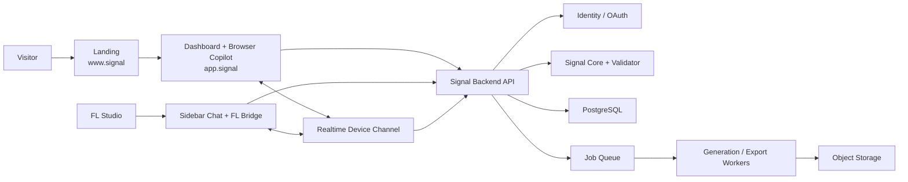

# Signal Platform Plan

Дата: **21 июля 2026 года**

## Цель

Построить Signal как одну платформу с четырьмя согласованными поверхностями:

1. **Landing** — объясняет ценность, показывает продукт, приводит к browser demo, регистрации и установке sidebar.
2. **Dashboard** — управляет аккаунтом, проектами, Creator DNA, разговорами, browser-copilot, экспортами, устройствами и billing.
3. **Sidebar Chat** — sidebar-like окно внутри/рядом с FL Studio, получает DAW-контекст, ведёт тот же chat и вставляет выбранный результат в Piano Roll.
4. **Backend** — единая identity, Signal Core, chat/generation jobs, artifacts, exports, device linking и observability.

## Рабочие архитектурные допущения

- ранний SaaS/MVP;
- один разработчик или маленькая команда;
- первые 1,000 пользователей;
- один основной регион;
- FastAPI сохраняется как backend preference из исходной идеи;
- web surfaces используют общий React/TypeScript design system;
- сначала modular monolith, не микросервисы;
- PostgreSQL — source of truth;
- object storage — MIDI, bundles и будущие audio artifacts;
- Redis/queue — generation, export и analysis jobs;
- базовые MIDI transforms могут работать локально;
- cloud AI не является обязательным для каждого запроса.

Пересмотр нужен, если команда, масштаб, compliance или realtime-нагрузка существенно изменятся.

## Единая схема платформы



## Product promise by surface

| Surface | Primary promise | Не должна делать |
|---|---|---|
| Landing | «Покажи, зачем Signal нужен именно мне» | имитировать полноценный app |
| Dashboard | «Создавай, продолжай, управляй и экспортируй» | притворяться, что видит FL context без подключения |
| Sidebar | «Работай с текущим проектом без выхода из FL» | хранить постоянные secrets в `.flp` |
| Backend | «Одинаковые validated results везде» | доверять unstructured model output |

## Единый пользовательский путь

### Новый пользователь

1. Заходит на landing.
2. Запускает ограниченный browser demo без обязательной регистрации.
3. Загружает/создаёт короткий MIDI context.
4. Получает четыре варианта.
5. Для сохранения создаёт account.
6. Попадает в dashboard.
7. Устанавливает sidebar/bridge.
8. В sidebar нажимает `Connect account`.
9. Системный браузер открывает dashboard authorization.
10. Пользователь подтверждает устройство.
11. Sidebar получает короткоживущий access и появляется в `Connected devices`.

### Работа в FL Studio

1. User выделяет MIDI.
2. FL adapter передаёт минимальный `MusicalContext` в local bridge/sidebar.
3. User пишет request или выбирает operation.
4. Backend/local core создаёт `CandidateSet`.
5. Sidebar показывает preview и различия.
6. User выбирает `Insert`, `Replace`, `Add after` или `Save to dashboard`.
7. FL adapter вставляет только validated notes.
8. Conversation и разрешённые artifacts синхронизируются с dashboard.

### Работа в браузере

1. User открывает существующий project/conversation либо создаёт новый.
2. Загружает `.mid`, использует browser Piano Roll или продолжает FL conversation.
3. Делает те же `Continue`, `Variation`, `Simplify`, `Humanize`, `Bassline`, `Harmonize`.
4. Preview через Web Audio/Tone-like synth.
5. Сохраняет candidate.
6. Если FL sidebar online — нажимает `Send to FL`.
7. Если offline — экспортирует `.mid` или conversation bundle.

## Conversation как центральная сущность

Один разговор доступен и в dashboard, и в sidebar. Он состоит из:

```text
Project
  └── Conversation
       ├── Message
       ├── ChatRequest
       │    └── GenerationJob
       │         └── CandidateSet
       │              └── Artifact(s)
       ├── Selection / UserDecision
       └── ExportJob(s)
```

Статусы `ChatRequest`:

- `draft`;
- `queued`;
- `running`;
- `needs_input`;
- `completed`;
- `failed`;
- `cancelled`.

Только `completed` request с валидным CandidateSet считается завершённым результатом.

## Экспорт завершённых запросов и результатов

### Уровень 1 — отдельный результат

- `.mid` — выбранные notes;
- `.json` — canonical artifact + provenance;
- `.wav` — только если preview/render существует;
- `Send to FL` — realtime доставка в подключённый sidebar.

### Уровень 2 — запрос

- prompt/intent;
- source context summary;
- controls;
- все или только выбранные candidates;
- model/generator version;
- seed;
- validation report;
- selected result;
- timestamps.

Форматы: Markdown + JSON + MIDI artifacts.

### Уровень 3 — conversation bundle

ZIP:

```text
manifest.json
transcript.md
requests.jsonl
artifacts/
  candidate-001.mid
  selected-result.mid
previews/
  selected-result.wav   # если существует
checksums.txt
```

### Уровень 4 — account privacy export

Отдельный процесс. Не смешивать creative bundle и полный export персональных данных.

## Browser authorization sidebar

### Primary flow: Authorization Code + PKCE

1. Sidebar/companion генерирует `code_verifier`, `code_challenge`, `state` и `nonce`.
2. Открывает системный browser, не embedded WebView.
3. User входит в dashboard и подтверждает устройство/scopes.
4. Redirect идёт на ephemeral loopback `127.0.0.1` listener companion app.
5. Companion обменивает code + verifier на tokens.
6. Tokens сохраняются в OS Keychain/Credential Manager.
7. Sidebar получает session status, но не raw refresh token.

Native-app best practice рекомендует внешний browser и PKCE; loopback redirect является предусмотренным desktop pattern. [RFC 8252](https://datatracker.ietf.org/doc/html/rfc8252)

### Fallback: Device Authorization Grant

Sidebar показывает короткий code и открывает `app.signal/activate`. User подтверждает устройство в browser; sidebar polling получает завершение. Это подходит, если loopback блокируется host/firewall. [RFC 8628](https://datatracker.ietf.org/doc/html/rfc8628)

### Token policy

- sidebar является public client и не содержит client secret;
- access token короткоживущий;
- refresh token rotating или sender-constrained;
- минимальные scopes;
- revoke из dashboard;
- revoke on suspected replay;
- token никогда не сохраняется в `.flp`, preset, log или plain JSON;
- browser dashboard использует secure HttpOnly session cookie/BFF, а не хранит bearer token в localStorage.

OAuth Security BCP требует ограничивать privileges и для public clients использовать rotation или sender-constrained refresh tokens. [RFC 9700](https://datatracker.ietf.org/doc/rfc9700/)

## Shared contracts

Все surfaces используют versioned schemas:

- `MusicalContext`;
- `Intent`;
- `GenerationControls`;
- `CandidateSet`;
- `ArtifactManifest`;
- `ConversationExportManifest`;
- `DeviceSession`;
- `ProgressEvent`;
- `ErrorEnvelope`.

Browser и sidebar не должны самостоятельно интерпретировать свободный текст модели как MIDI.

## Realtime synchronization

REST используется для durable commands/queries. SSE подходит для progress одной generation/export job. WebSocket нужен только для:

- device presence;
- `Send to FL`;
- candidate ready events;
- conversation updates между dashboard и sidebar.

При разрыве WebSocket данные не теряются: durable state находится в PostgreSQL/object storage, client выполняет resync по cursor/version.

## Общий порядок создания

1. Backend contracts + auth skeleton.
2. Dashboard shell + browser copilot minimal vertical slice.
3. Landing вокруг уже работающего demo.
4. Sidebar auth/pairing + chat shell.
5. FL context bridge + safe insertion.
6. Conversation synchronization.
7. Export center.
8. Creator DNA.
9. Billing и public launch.

Landing можно визуально собрать раньше, но нельзя публично обещать неподтверждённые sidebar capabilities.

## Масштабирование без преждевременных микросервисов

### Stage 0: 0–1,000 users

- modular FastAPI monolith;
- one PostgreSQL;
- managed object storage;
- Redis queue;
- separate worker process;
- one region;
- CDN for landing/assets.

### Stage 1: 1,000–10,000 active users

- horizontal API/worker scaling;
- queues by workload: `interactive`, `analysis`, `export`;
- autoscaling;
- database pooling;
- rate limits/quotas;
- dedicated realtime process only if needed.

### Stage 2: 10,000–100,000

- read replicas;
- artifact lifecycle policies;
- independent generation worker fleets;
- dedicated export workers;
- event outbox;
- separate realtime gateway;
- split services only where scaling/team ownership proves need.

### Stage 3: 100,000+

- regional inference strategy;
- data residency review;
- partitioned conversations/jobs;
- dedicated generation orchestrator;
- multi-region disaster recovery;
- enterprise/team boundaries if demanded.

## Architecture decisions

1. **Modular monolith before microservices.** Smaller operational surface; extraction triggers documented.
2. **One shared Signal Core.** Browser and sidebar outputs remain consistent.
3. **Browser-based native authorization.** No passwords/token paste inside plugin.
4. **Async jobs for AI/export.** Request handlers do not wait for slow models.
5. **PostgreSQL + object storage.** Metadata and binary artifacts separated.
6. **Artifact/provenance model first-class.** Export and reproducibility are not afterthoughts.
7. **Local validation before FL mutation.** Backend success alone does not authorize insertion.
8. **No content telemetry by default.** Metrics use derived operational events.

## Папки реализации

- [landing](./landing/)
- [dashboard](./dashboard/)
- [sidebar-chat](./sidebar-chat/)
- [backend](./backend/)

