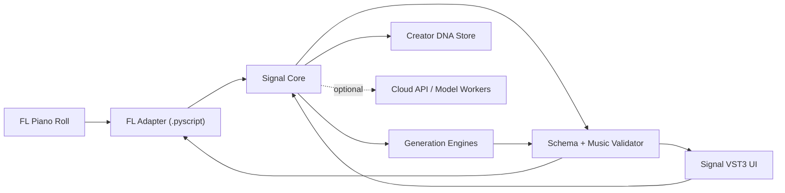

# 08. Архитектура

## Архитектурная цель

Отделить музыкальную ценность Signal от конкретного UI и DAW API. FL Studio adapter должен быть тонким слоем, а generation/profile/evaluation — независимым core.



## Компоненты

### 1. DAW Adapter

Ответственность:

- получить доступный host context;
- преобразовать notes в canonical schema;
- передать intent/controls;
- preview или вставить выбранный Candidate;
- не менять проект без явного подтверждения;
- поддержать fallback и понятные ошибки.

FL adapter не должен содержать основную музыкальную логику.

### 2. Signal Core

Чистая библиотека/сервис:

```text
MusicalContext + Intent + Controls + OptionalProfile
    -> CandidateSet
```

Core отвечает за:

- normalization;
- feature derivation;
- constraint building;
- выбор generator;
- diversity;
- ranking;
- provenance;
- telemetry hooks без скрытого сбора содержимого.

### 3. Validator

Обязательный слой между любой AI-моделью и DAW.

Проверяет:

- schema;
- note range;
- duration и bounds;
- отрицательные start times;
- invalid velocity;
- запрещённые overlaps для monophonic mode;
- соответствие key/scale, если constraint жёсткий;
- максимальную polyphony;
- пустой результат;
- чрезмерное literal copying исходника;
- diversity между variants.

Невалидный output никогда не попадает напрямую в проект.

### 4. Generation Engines

Не один «AI», а hierarchy:

1. deterministic transforms;
2. rule/probability generator;
3. trained symbolic model;
4. cloud model;
5. external audio renderer в будущем.

Core выбирает самый дешёвый и надёжный engine, способный выполнить intent.

### 5. Creator DNA Store

Хранит derived profile, а не проекты по умолчанию.

- local SQLite/embedded store для MVP;
- encrypted cloud sync только opt-in;
- versioned feature definitions;
- export/delete profile;
- разделение raw source, derived features и feedback.

### 6. Cloud API

Нужен только для моделей, которые невозможно или невыгодно запускать локально.

Требования:

- asynchronous jobs;
- request id и idempotency;
- strict JSON schemas;
- timeout/cancel;
- retry только безопасных операций;
- per-request cost logging;
- model/prompt version;
- rate limits;
- privacy-aware logging;
- graceful local fallback.

## Предлагаемая структура будущего репозитория

```text
signal/
  adapters/
    fl-piano-roll/
    vst3/
  core/
    schemas/
    transforms/
    generation/
    validation/
    ranking/
    profiles/
  services/
    api/
    worker/
  apps/
    desktop/
  evaluation/
    fixtures/
    baselines/
    regression/
  installers/
  docs/
```

Фактические языки и framework выбираются после spike. Структура отражает границы, а не обязательный monorepo implementation.

## Локальный и облачный контуры

### Local path

```text
Piano Roll -> canonical context -> deterministic/rule generator
-> validator -> insert
```

Цель latency: ощущение обычного музыкального tool, а не web request.

### Cloud path

```text
context minimization -> encrypted request -> async generation
-> validation -> local preview -> explicit insert
```

В cloud не нужно отправлять весь `.flp`, названия треков или audio, если intent решается selected MIDI.

## Real-time safety

Если появляется VST:

- никаких network calls в audio callback;
- никаких file writes в audio callback;
- никаких memory allocations с непредсказуемой задержкой;
- preview scheduling отделён от UI/network;
- crash core не должен разрушать host;
- state serialization ограничена и versioned;
- background worker может быть остановлен при unload.

## State model

Плагин сохраняет в проекте только:

- ссылки/ID профиля;
- последнюю безопасную конфигурацию;
- seeds и provenance вариантов, необходимых для воспроизведения;
- небольшой candidate history;
- UI state.

Большие audio/assets не встраиваются в plugin state без необходимости.

## API boundary example

```json
{
  "schema_version": "1.0",
  "request_id": "uuid",
  "intent": "variation",
  "context": {
    "tempo_bpm": 140,
    "time_signature": [4, 4],
    "ppq": 96,
    "key": {"tonic": 1, "mode": "minor", "confidence": 0.86},
    "notes": []
  },
  "controls": {
    "bars": 4,
    "variation_strength": 0.35,
    "rhythm_change": 0.2,
    "pitch_change": 0.5,
    "candidate_count": 4
  },
  "profile_id": null
}
```

## Нефункциональные требования MVP

- local generation p95 < 500 ms для 8 тактов;
- cloud generation p95 < 5 s или streaming/progress;
- 100% candidate outputs проходят validator;
- ни одна ошибка generation не меняет проект;
- deterministic reproduction по seed для deterministic engine;
- crash-free sessions > 99.5% в beta;
- offline mode сохраняет базовые transforms;
- содержимое MIDI не попадает в product analytics по умолчанию.

