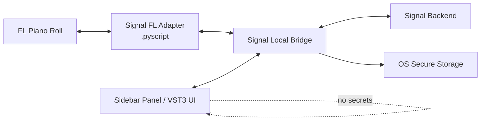

# 02. Интеграция с FL Studio и local bridge

## Подтверждённые возможности

FL Piano Roll Scripting API позволяет читать, создавать, изменять и удалять notes и markers через Python scripts. [Официальная документация](https://www.image-line.com/fl-studio-learning/fl-studio-online-manual/html/pianoroll_scripting_api.htm)

FL Studio поддерживает VST3 и CLAP на Windows/macOS; VST3 — основной cross-platform target. [Plugin formats](https://www.image-line.com/fl-studio-learning/fl-studio-online-manual/html/plugins_supported.htm)

## Ограничение

Обычный VST3 не получает произвольный доступ ко всему FL project/Piano Roll. Поэтому UI panel и deep note mutation нужно разделить.

## Компоненты

### FL Adapter

- captures selected/all notes;
- canonicalizes context;
- receives validated artifact;
- checks destination/staleness;
- inserts notes;
- reports result;
- minimal/no networking if possible.

### Local Bridge / Companion

- browser OAuth/PKCE;
- secure token storage;
- network/SSE/WebSocket;
- local cache;
- IPC with panel and adapter;
- version handshake;
- local generation/validation later;
- update/diagnostics.

### Sidebar Panel

- chat/controls;
- candidate UI;
- preview;
- device/project state;
- no raw refresh token;
- no direct unsafe project mutation.

## Why companion process

Хранить auth/networking внутри FL process опаснее:

- plugin crash влияет на host;
- secure storage сложнее;
- OAuth loopback lifecycle связан с audio host;
- network libraries могут блокировать;
- update/restart сложнее.

Companion изолирует account/network/cloud concerns. Trade-off — отдельная установка и IPC.

## IPC options spike

### Preferred

Authenticated loopback IPC:

- bind `127.0.0.1`, not all interfaces;
- random per-install secret from secure storage;
- per-session nonce;
- strict schemas/size limits;
- version handshake;
- no arbitrary filesystem paths/code;
- SSE/WebSocket/local HTTP depending capability.

### Fallback

- shared JSON file in dedicated user-data folder;
- atomic write/rename;
- file permissions;
- one-time command IDs;
- checksums;
- explicit cleanup.

### Last-resort product fallback

- signed/temp MIDI artifact;
- drag/drop/import;
- worse UX but safe.

Capabilities of `.pyscript` filesystem/network access must be tested; official docs do not promise full IPC.

## Capture flow

1. User selects notes.
2. Runs `Signal: Send selection` or panel triggers supported adapter action.
3. Adapter creates `ContextEnvelope` with `context_version` and content hash.
4. Bridge validates and stores short-lived local context.
5. Panel displays exact summary.
6. Backend receives only minimized context required by request.

## Insertion flow

1. Candidate manifest received.
2. Bridge verifies auth/schema/checksum.
3. Adapter performs defensive music validation.
4. Adapter verifies source context version/hash where relevant.
5. User confirms destination/mode.
6. Adapter mutates Piano Roll.
7. Adapter reports note count/status.
8. Dashboard/sidebar updates artifact status.

## Stale-context policy

Если source changed:

- `Replace selection` blocked;
- `Add after` requires review of new position;
- user can recapture and regenerate;
- export remains available;
- no silent rebase in MVP.

## Preview options

1. Panel internal lightweight synth.
2. VST MIDI output routed to selected instrument.
3. Browser/dashboard preview.

MVP может использовать internal preview, если MIDI routing слишком host-specific. Production preview не должен требовать audio generation.

## `.flp` state

Allowed:

- plugin UI state;
- non-secret conversation/project ID;
- selected profile ID;
- compact candidate references/seeds;
- adapter version.

Forbidden:

- access/refresh tokens;
- passwords/client secrets;
- raw private keys;
- full unencrypted conversation cache;
- large artifacts без необходимости.

## Real-time safety

- no network/file/OAuth in audio callback;
- bounded memory;
- background threads stop cleanly;
- UI cannot block transport;
- plugin unload/reload safe;
- companion crash leaves FL stable;
- update does not mutate project.

## Supported-version strategy

- current stable FL 2026 first;
- previous version only after capability test;
- Windows/macOS test matrix;
- explicit architecture requirements;
- version handshake blocks unsafe incompatible mutation while leaving export available.

