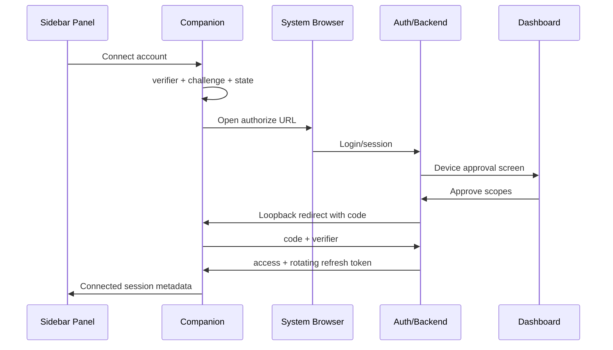

# 03. Browser authorization и device security

## Goals

- user logs in through trusted system browser;
- sidebar never sees password;
- no permanent manually pasted token;
- device can be revoked from dashboard;
- compromise impact limited by scopes/expiry;
- flow works inside constrained DAW environment.

## Primary authorization flow

Authorization Code + PKCE, external browser:



RFC 8252 recommends external user-agent and PKCE for native public clients; embedded login WebView не используется. [RFC 8252](https://datatracker.ietf.org/doc/html/rfc8252)

## Fallback device flow

1. Companion requests `device_code/user_code`.
2. Panel shows URL + code and `Open browser`.
3. User logs in/approves in dashboard.
4. Companion polls with required interval.
5. Code expires and is single-use.
6. Tokens saved in secure storage.

[RFC 8628](https://datatracker.ietf.org/doc/html/rfc8628)

## Why not manual API token

- users paste tokens into screenshots/support chats;
- hard to scope/rotate;
- encourages long-lived bearer secrets;
- often ends up in preset/config/project;
- poor revoke/device visibility;
- weak phishing resistance.

Можно оставить developer token только для explicit developer/API program later, не для consumer sidebar login.

## Public client model

Sidebar/companion installation не может хранить confidential client secret. Любой embedded secret можно извлечь. Поэтому:

- public client registration;
- PKCE required;
- exact redirect path;
- state/nonce;
- no implicit flow;
- no password grant;
- access scopes minimal;
- refresh token rotation or sender constraint.

[OAuth Security BCP RFC 9700](https://datatracker.ietf.org/doc/rfc9700/)

## Token storage

- macOS Keychain;
- Windows Credential Manager/DPAPI-backed storage;
- companion owns storage;
- panel receives only current connection/session state or short local capability;
- logs redact Authorization headers/tokens/codes;
- support bundle verifies absence.

## Token lifetime working defaults

Точные values уточняются threat model:

- authorization code: minutes, single use;
- device code: 5–10 minutes;
- access token: 10–15 minutes;
- rotating refresh token: inactivity/absolute expiry;
- local panel capability: process/session lifetime;
- signed artifact URL: minutes.

## Device record

```json
{
  "device_id": "uuid",
  "user_id": "uuid",
  "display_name": "Studio Mac",
  "client_type": "signal_fl_sidebar",
  "os": "macOS",
  "app_version": "0.1.0",
  "scopes": [],
  "authorized_at": "iso8601",
  "last_seen_at": "iso8601",
  "revoked_at": null
}
```

Не хранить machine fingerprint, если он не нужен и не прошёл privacy review.

## Revoke behavior

1. User clicks revoke in dashboard.
2. Device grant/refresh family invalidated.
3. Realtime channel closed.
4. Current access token denied/expired according to strategy.
5. Companion deletes secure credentials.
6. Sidebar switches to local/disconnected mode.
7. Project remains safe; no mutation.

## Threats and mitigations

| Threat | Mitigation |
|---|---|
| Authorization code interception | PKCE, state, exact redirect |
| Fake sidebar asks for login | system browser, clear device approval |
| Refresh token theft | secure storage, rotation/replay detection |
| Token saved in `.flp` | strict state schema/tests |
| Local malicious process calls bridge | loopback auth, per-session nonce, schemas |
| Device code phishing | show device details/scopes, short TTL, user confirmation |
| Stolen signed artifact URL | short TTL, scope, single/limited download |
| Revoked device stays online | server push disconnect + auth checks each command |

## Acceptance tests

- approve/deny;
- browser already logged in/logged out;
- loopback port blocked;
- state mismatch;
- code reuse;
- device flow slow_down/expiry;
- refresh rotation/replay;
- revoke while generation running;
- FL/project reopen contains no token;
- logs/support bundle contain no secret;
- offline mode after auth expiry.

